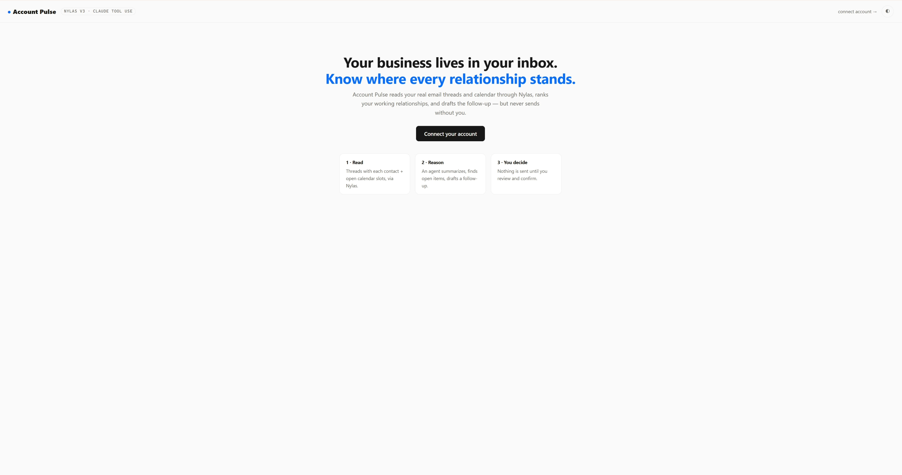

# Account Pulse

Ask "how is my relationship with {contact} doing?" and get a grounded answer:
a summary built from real email threads, open action items, and meeting slots
proposed from real calendar availability — powered by Nylas v3 primitives with
an LLM agent layer on top.

## ▶️ Demo video (2 min)

<div align="center">

[](https://youtu.be/kdjRjKJaFu0)

**[▶ &nbsp;Watch on YouTube →](https://youtu.be/kdjRjKJaFu0)**

</div>

## Why I built this

Modern app workflows are turning into agent workflows, and an agent is only as
useful as its access to real communication state. For most working
relationships that state lives in two places: the inbox and the calendar.
Nylas exposes both as clean, provider-agnostic primitives — hosted auth,
threads, availability, send — so a developer can spend their time on the
intelligence layer instead of fighting IMAP and OAuth per provider.

I wanted to feel that boundary hands-on rather than read about it: Nylas owns
the communication primitives; I own the agent — the prompts, the tool design,
the grounding rules, and the decision about what an agent may and may not do.

## What it does

- Connect a Google/Microsoft account via **Nylas Hosted Auth** (one grant, stored locally)
- **Book of business**: your last 30 days of threads aggregated per contact —
  who's owed a reply, what's going cold — straight from the threads API
- **Pulse** on any contact: a Claude agent (tool use) pulls real threads and
  real availability through Nylas and produces a summary, last touch, open
  action items, and 2–3 proposed slots from the actual calendar
- Drafts a short follow-up email you can **edit in place**
- **Only after explicit confirmation** is the draft sent via the Nylas send
  API, returning a real message id



## Architecture

```
Hosted Auth ──► grant_id (local JSON store)
                    │
web UI / CLI ────► Claude agent (tool use)
                    ├─ search_threads   ─► GET /v3/grants/{id}/threads?any_email=…
                    ├─ get_thread       ─► GET /v3/grants/{id}/messages?thread_id=…
                    ├─ get_availability ─► POST /v3/calendars/availability
                    └─ draft_followup   ─► pure LLM (records the draft)
                    │
human confirms ──► POST /v3/grants/{id}/messages/send  ─► message id
```

Design decision worth noting: the agent can read and draft, but **cannot
send**. There is no send tool in its tool surface; sending is app code behind
an explicit confirmation. An agent that composes email should propose — a
human should dispose.

## Running it

```bash
git clone <this repo> && cd account-pulse
npm install
cp .env.example .env   # fill in the keys
```

Nylas setup (sandbox): create a v3 app in the [Nylas dashboard](https://dashboard-v3.nylas.com),
add `http://localhost:3000/auth/callback` as a callback URI, and copy the API
key + client id into `.env`. For the LLM, set either `ANTHROPIC_API_KEY` or
`OPENROUTER_API_KEY` (Claude Sonnet 4.6 either way; `OPENROUTER_MODEL` can
point at a cheaper model for dev runs).

```bash
npm run dev                        # start the server
# visit http://localhost:3000 and connect a test account

npm run pulse -- someone@example.com          # CLI pulse (review only)
npm run pulse -- someone@example.com --raw    # raw threads + availability, no LLM
npm run pulse -- someone@example.com --send   # pulse, then confirm-to-send
npm test                                      # unit tests (mocked HTTP)
```

## DX notes from building this

Honest observations from building and running this against the real v3 sandbox:

- **Hosted Auth is genuinely fast to stand up** — redirect out, code back,
  one token exchange, done. The part that cost me time was not the flow but
  the dashboard prerequisite: an unregistered callback URI fails with
  `Status 701: invalid_query_params`, which reads like a malformed-request
  bug until you spot the "RedirectURI is not allowed" detail underneath.
- **`client_secret` for the token exchange is your API key.** Documented, but
  surprising if you're pattern-matching on standard OAuth apps that issue a
  separate client secret.
- **Error responses are good.** Every failure I hit carried a `request_id`
  and a concrete message. The availability endpoint rejecting my timestamp
  with `'start_time' must be a multiple of 5 minutes` told me exactly what to
  fix in one read.
- **Pagination is uniform and boring (in the best way)** — every list
  endpoint takes `page_token`, returns `next_cursor`, wraps results in
  `{request_id, data}`. I wrote the pagination loop once and it worked for
  threads, messages, and calendars unchanged.
- **`any_email` does what a CRM actually needs** — one query param covers
  from/to/cc/bcc, so "everything with this contact" is a single filtered
  threads call, not four merged searches.
- **The availability endpoint is not grant-scoped** (`POST
  /v3/calendars/availability` with participants), which confused me for a
  minute coming from the `/v3/grants/{id}/...` pattern everywhere else —
  but it makes sense once you think about multi-participant scheduling.
- **The sandbox sends real email.** Great for proving the send path returns
  a real message id; worth knowing before you wire an agent draft to a
  one-click send button on a personal account.
- One choice worth explaining: this repo talks to the v3 REST API with a
  small hand-rolled `fetch` wrapper instead of the official Node SDK. For a
  prototype whose point is understanding the API contract — params,
  pagination, error envelope — keeping the HTTP visible was more instructive.
  In a production app I'd use the SDK.

## What I'd explore next

- Webhooks (`message.created`) to suggest a pulse refresh when a tracked contact writes back
- Creating a calendar event (contact as participant) once a proposed slot is accepted
- Smarter machine-sender detection for the book of business (the current regex heuristic is the weakest part)
